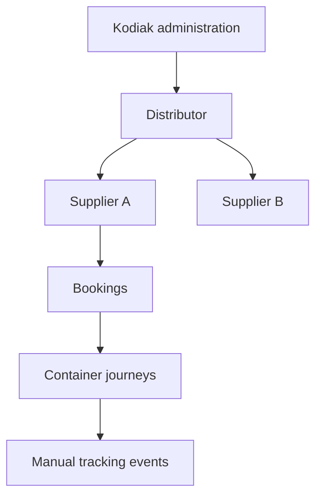
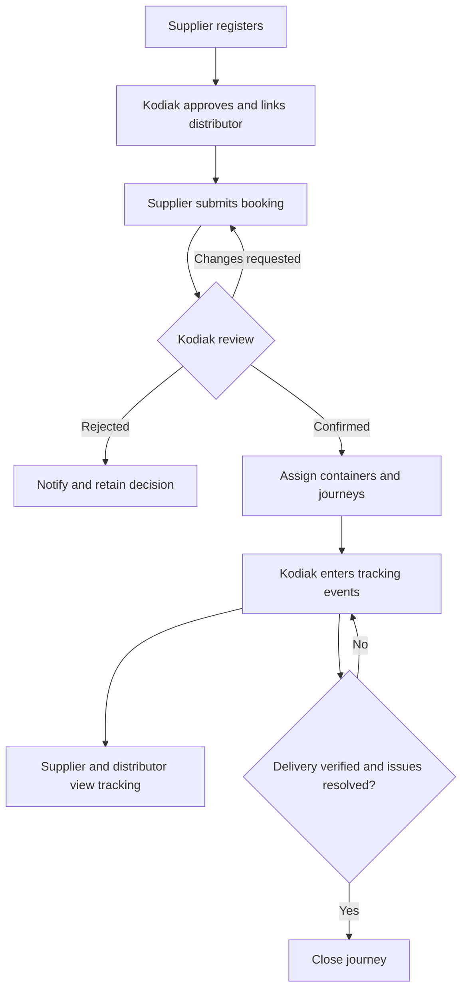

# Kodiak — Business Plan, Project Plan and Workflows

Version 2.0 • 1 October 2026 • Revised planning draft

## 1. Business purpose and confirmed scope

Kodiak is a courier and logistics company sending and receiving containers between countries and ports, for example Mumbai, India → Jebel Ali, UAE. The exact ports will be selected from Kodiak's port directory.

The application serves Kodiak and its business network. Kodiak has full administrative control: manage distributors and suppliers, create bookings, assign containers, manually update tracking, hold shipments, and blacklist suppliers or physical containers. Suppliers can register from the login screen, book containers, and track their own work. Every supplier belongs to a distributor; that distributor can see and track its suppliers' containers. One distributor is associated with each container journey through the supplier relationship.

Build a responsive web application first, followed by iOS and Android apps using the same backend. All operational source data and tracking events are manually entered. Validation, dashboard calculations, reminders, and notifications can run automatically from that data; they do not constitute live tracking.

This revision replaces the earlier idea that suppliers choose a different distributor for each shipment. A distributor is a supplier's parent business organization, not necessarily the physical consignee or delivery recipient.

The attached demo video could not be decoded in the available environment. No features below are claimed to have been observed in it. Demo comparison remains a discovery task. Recommendations below are planning proposals rather than confirmed business policies.

## 2. Business plan

### Value and operating model

Kodiak gets one operational record from registration and booking to dispatch, destination arrival, delivery, and closure. Suppliers get self-service entry and visibility; distributors get oversight of their supplier network. Kodiak staff spend less time collecting status information across separate calls, messages, and spreadsheets.

Kodiak should appoint a business owner, an operations lead, and a technical support owner. Named staff approve accounts/bookings, maintain milestones, and resolve exceptions. Suppliers provide accurate booking data. Distributors monitor their network and raise queries. A daily operations queue should highlight pending applications/bookings, upcoming departures and arrivals, overdue shipments, stale tracking, open holds, and missing documents. Each exception has an assigned Kodiak owner and follow-up date.

Agree an update target during discovery, such as entry by the next working day after Kodiak receives verified information. Display the last update time so users can judge freshness.

### Success measures

Establish a baseline before the pilot and measure after four weeks. Proposed targets:

| Measure | Target |
|---|---|
| Active suppliers linked to an approved distributor | 100% |
| Pilot-scope bookings recorded in the system | At least 95% |
| Updates entered within the agreed target | At least 95% |
| Important changes attributable to a named actor and time | 100% |
| Staff time spent answering status questions | 30% lower than baseline |
| Critical access-control or data-loss defects at launch | Zero open |

### Investment and budgeting

This is Kodiak's operating platform, not a subscription service sold to other logistics companies. Freight quotations, invoicing, and payment collection are separate optional modules.

Budget for discovery/design, backend/web development, QA, deployment, training, mobile development, and support. Recurring costs include hosting, database/document storage, monitoring, backups, maintenance, and selected external notification channels. Mobile also needs developer accounts and release preparation.

Build budget = person-days by role × agreed rates + setup costs + contingency. Use a provisional 15–20% contingency until scope is agreed. A currency estimate needs staffing rates, user/shipment volume, hosting requirements, and approved scope.

Monthly benefit = evidenced staff hours saved × internal hourly cost + other demonstrated savings. Payback = initial investment divided by monthly benefit minus monthly running cost, only when net monthly benefit is positive. Better visibility alone does not guarantee shipping-cost savings.

## 3. Organization structure and permissions

Proposed default: one approved distributor per active supplier. Kodiak owns this relationship. New registrants can provide a distributor reference or remain pending while Kodiak assigns one; they cannot grant themselves access to a distributor's records.

Each organization can have multiple named users. Kodiak can subdivide its internal privileges into Super Admin, Operations, and Reporting without adding new external business roles.

| Capability | Kodiak | Distributor | Supplier |
|---|---|---|---|
| Manage distributors and suppliers | Full control | View linked suppliers | Own profile/change requests |
| Approve registration and distributor relationship | Yes | Referral request only, if enabled | No |
| Create booking | On behalf of a supplier | Not initially | Own organization |
| Confirm/reject booking and assign containers | Yes | No | No |
| View bookings and tracking | All | Authorized linked supplier records | Own organization |
| Enter official tracking status | Yes | No | No |
| Hold/release journeys | Authorized staff | View permitted details | View permitted own details |
| Blacklist/unblacklist supplier/container | Authorized staff | No | No |
| Request correction/cancellation or raise query | Yes | Authorized records | Own records |
| Reports and exports | Company-wide | Authorized network scope | Own scope |
| Full audit/internal notes | Authorized staff | No | No |

Server-side permissions must protect every record, document, search, report, export, and notification. Hiding buttons is insufficient.

### Distributor transfers — proposed policy

A booking inherits the supplier's distributor when submitted. Submitted bookings and container journeys retain that assignment. Transferring a supplier affects new bookings; historical access follows each record's retained distributor. Kodiak can explicitly transfer selected open records with an audited reason. The former distributor loses access to transferred records, although previously downloaded copies cannot be recalled. Agree this policy before development; automatically transferring all history is a different business rule.

## 4. Workflows

### Supplier registration

1. Select Register as Supplier on the login screen.
2. Enter company/contact information, country, address, and requested distributor/reference if known.
3. Kodiak checks duplicates and supporting information, requests corrections if needed, and confirms the distributor.
4. Kodiak approves or rejects with a reason. Pending accounts can complete their profile but cannot submit bookings or access operational records.
5. Approved suppliers can book and track. Public registration never allows selection of an Admin or Distributor role.

Proposed states: Pending Review → Changes Requested → Pending Review → Approved or Rejected. Account suspension is separate from business blacklisting. Contact verification/password recovery requires a configured channel, or an explicitly defined Kodiak-assisted process.

### Booking and container tracking

1. Supplier drafts a booking; Kodiak can also create one on its behalf.
2. Enter origin/destination countries and ports, requested dates, container type/quantity, cargo details, and required documents. Distributor is inherited and read-only.
3. Submit; validate approval, relationship, required data, and blacklist restrictions.
4. Kodiak requests changes, rejects, or confirms. Submission is a request, not confirmed capacity.
5. Kodiak assigns physical container numbers when known and creates a journey for each container.
6. Kodiak manually records milestones, actual event time, location, information source, and notes.
7. Supplier and authorized distributor see progress, expected dates, documents, visible holds, and last update time.
8. Kodiak records delivery evidence, resolves exceptions, and closes the journey.

Proposed: one booking can request several containers. Each container has independent tracking and holds, but all share the booking's supplier and distributor. Container numbers need not be known at booking submission; they must be recorded before dispatch. A booking remains partially completed until all journeys reach an agreed terminal outcome, with cancellations shown separately.

### Status model

Keep these separate:

- Booking review: Draft, Submitted, Changes Requested, Confirmed, Rejected, Cancelled.
- Physical progress: Container Assigned → Received at Origin → Loaded/Departed → In Transit → Arrived at Destination Port → Released/Cleared, if applicable → Out for Delivery, if applicable → Delivered → Closed.
- Exceptions: On Hold, Delayed, Delivery Discrepancy; retain the underlying physical progress.
- Restrictions: supplier or physical-container blacklist; not a shipment milestone.

Allow route-specific optional steps, intermediate ports, and transshipment legs. Expected and actual dates are separate. Passing an expected date may calculate an overdue flag but must never manufacture a tracking event. Record both event time and entry time with timezone labels. Backdated events and corrections retain history and reasons. Physical returns use linked new journeys.

Import/export is relative to a country or branch; agree that reference before using those labels. Always retain explicit origin and destination.

### Holds and blacklists

| Action | Proposed meaning and enforcement |
|---|---|
| Hold a container journey | Temporary operational restriction. Preserve physical status. Block authorization of onward processing/closure until released, while allowing factual tracking and documents to be updated. |
| Blacklist a physical container | Block new allocations/confirmation involving it; flag existing journeys for Kodiak review. |
| Blacklist a supplier | Block new submissions and confirmations; review active work explicitly. |
| Suspend login | Separate access restriction, controlled by Kodiak. |

Blacklisting does not erase history, cancel a journey automatically, or claim that a moving container has physically stopped. Proposed default: a blacklisted supplier retains read-only tracking and support access to existing shipments unless login is separately suspended. Kodiak decides whether each active shipment continues, is held, or is cancelled.

Record reason category, internal explanation, customer-visible explanation, actor/time, evidence, review date, release reason, and release actor/time. Multiple holds remain independent. Releasing one does not release the others. Recheck restrictions at both submission and confirmation/allocation because eligibility can change. Restriction history must remain auditable.

## 5. Screens

### Common screens

| Screen | Contents |
|---|---|
| Login/register/recovery | Supplier self-registration and secure account access |
| Profile/application status | Account details, review feedback, distributor assignment |
| Dashboard | Role-specific totals, exceptions, recent changes |
| Booking list/detail | Request state, review notes, containers, documents |
| Container tracking list | Search and filters by number, booking, supplier, route, status, dates, and holds within access scope |
| Tracking detail | Latest reported location, timeline, route legs, planned/actual dates, documents, visible restrictions, queries |
| Documents | Categorized files, versions, controlled downloads |
| Notification center | Read/unread events linked to authorized records |
| Reports | Scoped filters, results, exports |
| Help/query center | Correction/cancellation requests, shipment questions, responses |

Tracking pages prominently show Manually updated and Last updated. Any route diagram is illustrative rather than a live-position map. Searches distinguish current and historical journeys of the same physical container.

### Kodiak administration

- Management dashboard and operations queue.
- Distributor directory, supplier directory, registration approvals, relationship mapping/history.
- Staff accounts and permissions.
- Booking review, create-on-behalf, allocation, amendments, cancellation review.
- Physical container register and journey history.
- Tracking update and correction screen.
- Country/port/route, container-type, milestone, and reason master data.
- Hold/release queue, supplier blacklist, container blacklist.
- Departure/arrival calendar, overdue and stale-update queues.
- Delivery evidence, discrepancies, closure queue.
- Reports, notification rules, audit history, settings.

### Distributor

- Network dashboard and linked supplier directory/detail.
- Linked supplier bookings and container tracking.
- Upcoming arrivals, delays, visible holds, documents.
- Supplier activity comparison and scoped reports.
- Notifications and queries to Kodiak.

Suggested additions: supplier referral requests and saved filters. Distributor booking approval, supplier editing, and booking-on-behalf are not assumed. Receipt acknowledgement is only relevant if the distributor actually receives the goods.

### Supplier

- Registration/application status and profile.
- Own dashboard and assigned distributor details.
- New booking, drafts, changes requested, booking history.
- Own containers/tracking, documents, missing-document actions.
- Amendment/cancellation requests, queries, reports, notifications.

## 6. Dashboards and reports

| Dashboard | Main widgets |
|---|---|
| Kodiak | Pending registrations/bookings, active journeys, upcoming departures/arrivals, overdue arrivals, stale updates, open holds, blacklisted entities, route volume, delivered volume, unresolved queries |
| Distributor | Linked supplier count, bookings by supplier, active journeys, expected arrivals, delays/visible holds, completed deliveries, queries |
| Supplier | Draft/pending/confirmed bookings, active journeys, expected arrivals, requested documents, holds requiring action, recent updates |

Every widget links to its filtered records. Distinguish bookings, physical containers, and container journeys to avoid misleading counts.

Report catalogue:

| Report | Availability |
|---|---|
| Booking register, confirmations, rejections, cancellations | All roles, scoped |
| Container journeys and status summary | All roles, scoped |
| Country/port/route volume | All roles, scoped |
| Upcoming departures and arrivals | All roles, scoped |
| Overdue arrivals and reported delays | All roles, scoped |
| Hold history/duration | Kodiak full detail; others permitted record details |
| Supplier/distributor activity | Kodiak all; distributor its network; supplier own summary |
| Delivery completion and transit duration | All roles, scoped |
| Missing documents and unresolved queries | All roles, scoped |
| Registration turnaround | Kodiak; supplier sees own application status |
| Blacklist register/history | Authorized Kodiak staff only |
| Staff activity, corrections, audit | Authorized Kodiak staff only |

MVP: tables, totals, CSV exports, and printable browser views. Branded PDFs and formatted Excel exports can follow. Filters show date basis, timezone, generated time, and treatment of cancelled journeys.

Metric definitions: arrival-overdue means expected arrival passed with no actual arrival, excluding cancelled journeys; delivery-overdue is separate if an expected delivery date is recorded. Stale means no update within the agreed threshold for an active status. Transit duration uses actual departure/arrival and excludes missing endpoints with an explicit excluded count. Overlapping holds must not be summed as total downtime. Retain ETA revisions and the original estimate.

## 7. Notifications

| Event | Recipients |
|---|---|
| Registration submitted | Kodiak registration team; applicant confirmation |
| Registration approved/rejected/changes requested | Applicant |
| Supplier linked/transferred | Relevant parties, without unauthorized historical details |
| Booking submitted | Kodiak operations; supplier confirmation |
| Booking confirmed/rejected/changes requested | Supplier and authorized distributor |
| Milestone or expected-date change | Supplier and authorized distributor |
| Hold applied/released | Kodiak owner and affected parties, permitted explanation only |
| Blacklist applied/removed | Authorized Kodiak staff; affected party gets appropriate action wording |
| Approaching arrival, overdue, stale tracking | Assigned Kodiak operator; optional scoped customer reminders |
| Document request, query response, delivery/closure | Relevant authorized parties |

Start with in-app notifications. Email is optional but must be explicitly configured if used for verification or password reset; otherwise define assisted recovery. Mobile push follows with the apps. SMS/WhatsApp are separate integration scope.

Store recipient, source event, time, read state, and external delivery result when applicable. Deduplicate reminders, offer sensible preferences/digests, retry failed external delivery, and do not undo a saved booking because notification delivery failed. Recheck access after transfers; internal notes must never leak through alerts.

## 8. Data and technical plan

Core entities: Distributor, Supplier, User, Relationship History, Booking, Booking Container Requirements, Physical Container, Container Journey, Route Leg, Tracking Event, Hold/Blacklist Record, Document, Query/Request, Notification, Audit Entry.

A booking, physical container, and journey have separate IDs. The supplier relationship is approved master data; submitted records retain a distributor assignment. A physical container can be reused on future journeys. Prevent conflicting active allocations. Require approved supplier membership and mandatory route/cargo fields at submission, but allow physical container numbers to be assigned later. Confirmed bookings use amendments rather than unrestricted editing.

Use a shared authenticated API, relational database, private document storage, background reminders, and audit history. Web/iOS/Android use the same permissions and business rules. Choose frameworks after confirming team skills and deployment needs. Include test/production environments, encrypted access, admin multifactor authentication, controlled files, concurrency/version checks, monitoring, backups, and tested restoration. Agree data retention, hosting region, recovery objectives, user volume, and attachment volume in discovery.

Web MVP includes the three portals, onboarding, relationships, booking review/allocation, manual tracking, route legs, holds/blacklists, documents, basic queries, dashboards, report tables/CSV, in-app notifications, and audit.

Mobile follows validated workflows: supplier registration/booking/documents/tracking, distributor network visibility, Kodiak approval/tracking actions, and push. Confirm whether complex master-data administration needs mobile parity or can stay web-first.

Deferred: GPS/IoT, carrier/port integrations, OCR/imports, offline synchronization, anonymous public tracking, shared cargo across suppliers/distributors in one container, automated pricing, invoicing/payments, full accounting, and advanced forecasting.

## 9. Revised project plan

The expanded scope changes the initial estimate. Provisional web launch: 12–14 weeks, then a four-week operational review, then 8–10 weeks for mobile development and release preparation. Assumes a backend developer, web developer, part-time UX/QA/operations support, and an available Kodiak decision-maker; mobile adds a cross-platform developer with backend/QA support. These are planning ranges, not commitments.

| Phase | Window | Deliverable/exit gate |
|---|---|---|
| Discovery | Weeks 1–2 | Demo review, roles, supplier transfer policy, booking fields, milestone/restriction rules, reports, estimate |
| UX and design | Week 3 | Clickable portal flows, data/API design, prioritized backlog |
| Foundation/onboarding | Weeks 4–5 | Accounts, organizations, registration approval, permissions, master data |
| Booking/container operations | Weeks 6–7 | Requests, review, multi-container allocation, amendments/cancellation |
| Tracking/restrictions | Weeks 8–9 | Events, route legs, holds/blacklists, documents, queries |
| Visibility/verification | Weeks 10–11 | Dashboards, reports, notifications, audit, integrated testing |
| Pilot/web launch | Weeks 12–14 | Real-user pilot, fixes, training, restore test, acceptance |
| Operational review | Four weeks after launch | Adoption/freshness measures, workflow refinements, mobile priorities |
| Mobile/release preparation | Following 8–10 weeks | iOS/Android implementation, device tests, acceptance, submission |

Sequential total: approximately 24–28 weeks to mobile submission. External app-store review time is excluded. Mobile design may overlap operational review once workflows stabilize.

### Acceptance criteria

- Register, correct, approve, and link a supplier; pending/rejected users cannot submit bookings.
- Complete a multi-container booking with independent timelines/holds and partial completion.
- Verify cross-supplier/distributor isolation for screens, API, files, reports, exports, notifications.
- Verify supplier transfer and explicit record transfer obey the agreed historical-access policy.
- Verify multiple holds, release, blacklist enforcement at submission/confirmation/allocation, and active-shipment handling.
- Ensure only authorized Kodiak users change official milestones, relationships, and restrictions.
- Test amendments, cancellation, returns, reuse, transshipment, ETA revisions, and corrections.
- Reconcile dashboard/report counts and durations to sample records.
- Verify concurrent updates, notification failure handling, agreed load, and backup restoration.
- Obtain Kodiak acceptance, training completion, monitoring/support ownership, and launch rollback arrangements.

No open critical access/data-loss issues at launch. Any accepted lesser defects need named owners.

## 10. Risks and additional decisions

| Topic | Proposal |
|---|---|
| Stale manual tracking | Named owner, update target, last-updated display, stale queue |
| Distributor transfer exposes history | Agree access policy and test all outputs |
| Blacklist meaning is unclear | Separate business restrictions, physical progress, and login suspension |
| Multiple containers per booking | Include individual journeys and outcomes |
| Actual consignee/receiver | Capture separately from distributor where delivery is in scope |
| Empty-container returns | Decide whether required before closure; use linked return journey |
| Cargo/handling details | Agree commodity, package count, weight units, and handling instructions |
| Port storage/free-time reminders | Optional later enhancement using manually entered due dates |
| Quote, freight charges, invoice/payment | Optional module; decide whether confirmation requires agreed pricing |
| Distributor referral/on-behalf booking | Optional; viewing privileges do not imply these actions |
| Languages/timezones | Agree UI languages, date formats, and port/local time display |
| Document checklist | Agree documents required at each step and visibility by role |
| Mobile admin coverage | Decide which administrative screens must work in the mobile apps |

Next milestone: agree the proposed policies and turn this plan into a clickable Kodiak web prototype and implementation backlog. Application development has not started.
